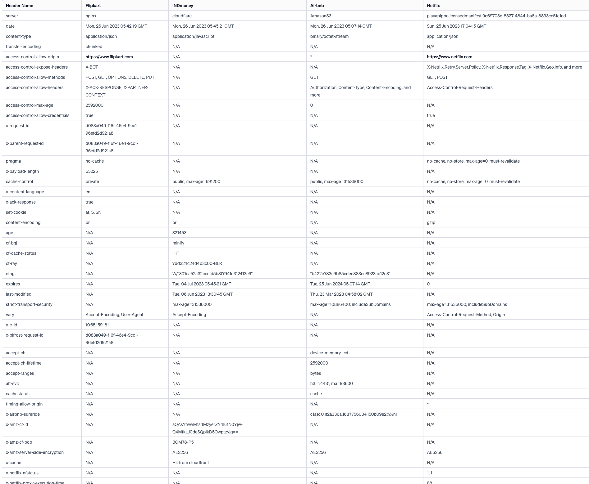

- [[toyj]]
	- Coconut oil in a small bowl over the gas stove for heating caught fire. Mother screamed, I rushed, entered the kitchen and without thinking for one bit, poured the water on top of it. The flames expanded exponentially up in the air. It was a scene out of a fire disaster movie, or an action movie, all action movies are fire disaster movies.
	  
	  Nothing happened, but I felt extremely guilty of having no presence of mind or knowledge about how the situation could or should have been handled. Ojas suggested that there should be a fire extinguisher installed in the Kitchen. I'm going to get one installed this week before flying.
- [[tech]] [[learning]] [[web]]
	- 
		-
- [[book snippets]] [[books]] [[The Carpet People]]
	- About Pismire playing fluteharp in the Deftmenes' celebrations. Snibril saying:
	  
	  > … by the way the notes went all over the place without ever hitting the tune. *Pismire always said there were some things you should care about enough to do badly*.
	  
	  [[toyj]] I think that holds true for [[writing]] doesn't it? I should care about it enough to do it badly, never minding the bad that comes out of practice.
	- [[card]] [[word]] Scurry #walkingwords
		- move hurriedly with short quick steps.
	- [[card]] [[word]] Teeter #walkingwords
		- move or balance unsteadily; sway back and forth.
		- Ex: “A couple of candles teetered out of the crazily-weaving lamps.”
	- [[card]] [[word]] lintel
		- horizontal support of timber, stone, concrete, or steel across the top of a door or window.
	- “Another tremor shook the hall. A pillar cracked, and Glurk grunted. “**Get out of the way!” came a whisper from deep in his throat**, “it's going to go.”
	  
	  What I liked about this *whisper from deep in his throat* under the stress of a whole structure he's preventing from falling. Very interesting imagination of reality. Stress whisper.
	- [[card]] [[word]] reveller
		- a person who is enjoying themselves in a lively and noisy way.
	- [[card]] [[word]] Billow
		- a large undulating mass of something, typically cloud, smoke, or steam.
		- Ex:
		  
		  >“Bane groped his way out of the billows, a rag pressed over his mouth. “Come on,” he said, “Brocando's got the secret door open.”
	- “Help me with this idiot,” said Pismire.
	  “Looks wedged to me,” said Bane.
	  “Gonna be a hero,” said Glurk.
	  “Shut up,” said Pismire. ***“That's what comes of listening to stories on an empty head. Stupid idea, anyway, wedging yourself under the door like that ... ”*** #humourwriting
	- “What ... mean?” **puffed** Pismire.” #verbs
	- “Pismire only had enough breath left to grunt.
	  "!”
	- [[card]] [[word]] Testily
		- easily annoyed
	- 'Is my brother with you?' said Brocando.
	  
	  After a pause, Gormaleesh said, 'In a manner of speaking. #chills
	- #humourwriting
	- “Brocando, who could count quite quickly for a king, said, “But what about-ow!”
	  
	  “Sorry,” said Pismire, who could count faster, “Did I accidentally kick you? Well, he's right. He's got all three of us.”
	  
	  “But we can't leave Gl-ow! Oh. Yes. Of course. Yes, I see. You're right.” Brocando's voice suddenly took on the kind of excited conspiratorial tone that would have made anyone smell a rat who didn't already smell like a moul. “All three of us. Yes. You've definitely got all three of us. How well can you see in the dark, incidentally? Probably not one-hundred-per-cent, eh?”
	- “Before it could growl, though, ***the hand bunched up into a knotted fist*** and smacked it smartly between the eyes.”
	- The next days merged for the prisoners into one continuous blur of running feet and moul voices. Feet blistered and bled, and minds were muddled by the constant pounding.
	- [[card]] [[phrase]] Mill around
		- **to move around an area without seeming to be going anywhere in particular**.
	- #humourwriting “As they struggled on the dank floor Gormaleesh's grinning face appeared at the bars, lit red in the torchlight of the dungeons. “Enjoy the hospitality of our dungeons while you may. Soon you'll go to the mines. There you will not sleep. But you'll be safe from Fray!”
	  
	  “Why do they talk like that?” said Pismire. “Melodrama. I'm amazed he doesn't go 'har-har-har'.”
	- [[card]] [[word]] Snarl
		- make an aggressive growl with bared teeth.
	- #description #action Glurk peered round a corner, and then beckoned them to follow him.
	- #humourwriting
	- “What's your business here?” said the moul guard.
	  
	  “Ah,” said Glurk, “I have brought the prisoners! Har-har-har!”
	  
	  The guard looked suspiciously at the four of them. “What for?” it said.
	  
	  Glurk blinked at him.
	  
	  “Enough of this talking, har-har-har,” he said eventually, and hit the guard on the head.
	  
	  The green eyes went out.
	  
	  “I runs out of ideas after a while,” said Glurk.”
	- “Then he [pone] opened his mouth and trumpeted.
	  
	  It sounded like the creaking of a door, magnified a thousand times-but it waved and changed as well, and seemed to contain a lot of busy little other sounds. Language, thought Pismire. Language without words, but still language.”
	- Self: It's fascinating that Glurk was able to know so much about what is happening, sneaking in, in his hunting way. And as funnily not smart he's shown, he being able to figure out the secret of intelligence of pones, Pismire not agreeing about what he said about pones first but then later seeing for himself, is a pleasant surprise.
		- Edit: AHAHAHAHAHAHA. I guess he isn't. Because a while after in the book:
		- “Now listen, Glurk,” said Pismire, “I mean, I'm not saying you're not, you know, quite bright, but I don't think you could have learned a language and all these other things in just a few-”
		  
		  “Didn't,” said Glurk, smirking. “Knew what to expect before I come here.”
		  
		  “How-”
		  
		  “Enough of this talking, har-har-har,” said Glurk. “Tell you later. Be polite, by the way. She said they understand people very well.”
		  
		  “Don't believe it,” said Pismire.
		  
		  One of the pones blew a raspberry in his ear.
		  
		  “That means they think you're interesting,” said Glurk.
		  
		  “And who's she?” Pismire demanded.
		  
		  “Tell you soon,” said Glurk. He was enjoying himself in a quiet way. For the whole of his life Pismire had known more than he did. It was nice, just for once, to be Mr. Answers.”
	- “They [pones] liked it here when the Vortgorns ran the place,” said Glurk. “They likes stuff they find interesting. The mouls don't interest them any more. They don't like them. I think they think we're interesting.”
	- “Up on Acretongue's back the four of them were shaken like small peas in a big pot”
	- [[card]] [[word]] stolid
		- calm, dependable, and showing little emotion or animation.
	- [[card]] [[word]] Lumber #walkingwords
		- to move in a slow, heavy way
	- [[card]] [[word]] plod #walkingwords
		- walk doggedly and slowly with heavy steps
	- Self: Oh Glurk Glurk you funny person
		- “But she's told you, and it worked,” said Brocando. “We can say thank you some other time-”
		  
		  “No,” said Pismire. “If Glurk's right, and she's told him something she remembers from the future, and we don't go ... then, I don't know, anything could happen. The whole fabric of the Carpet could roll up, or something. It would be the worst thing that could ever happen anywhere.”
		  
		  “Worse than-?” Brocando began.
		  
		  “Worse than anything you could possibly imagine,” said Glurk.”
	- [[card]] [[word]] Gingerly #walkingwords
		- very slowly and carefully so as not to cause harm, make a noise, etc.
	- #charactersketch #characterintro Culaina
		- “A figure stood a little way away. It was tall, with the thin face of a wight, and looked ghostly in the light of the crystal. It had a mass of white hair-it was hard to see where the hair ended and the shapeless long robe began. And she was young, but as she moved sometimes she was old, and sometimes she was middle-aged. Time moved across her face like shadows.”
	- “#everydayobjectfantasydescription At the far side of the clearing was Culaina's home, or one of her homes. It was no more than a roof of ***woven dust on poles***”
	- #🤯
	- “No,” said Culaina. “They remember only all those things that happen. We remember things that might happen. I remember what will happen if you don't win. I know all possibilities. For every thing that happens, a million things don't happen. I live all of them. I remember you winning, and I remember you losing. I remember the mouls triumphant, I remember you triumphant. Both are real, for me. For me, both of these have happened. My brother and sister wights remember the thread of history. But I remember all the threads that never get woven. For me, all possibilities are real. I live in them all.”
	  
	  “But why?” said Bane.
	  
	  “Someone must. Otherwise, they never could have happened.”
	- She's here ... somewhere,” he [Bane] said.
	  
	  “Everywhere,” said Pismire. “Everywhere there's a choice to be made.
	- [[card]] [[word]] Grove
		- a small wood or other group of trees.
	- [[card]] [[word]] Wily
		- skilled at gaining an advantage, especially deceitfully
	- [[card]] [[word]] Scamper #walkingwords
		- run with quick light steps, especially through fear or excitement.
	- >It must be like being blind [wights not knowing what was going to happen in the future], Snibril thought. We're used to not knowing what's going to happen
	- #humourwriting “Stop that!” he shouted. “You're soldiers! You're not supposed to fight!”
	  
	  Even the two combatants stopped to work that one out.
	- #humourwriting The rest of them marched on down the road. Snibril found that he was in command; the Munrungs wanted to follow him, ***the Deftmenes were beginning to think that anyone who could lose their temper that badly was probably a king, and the Dumii-well***, the Dumii soldiers followed Sergeant Careus, and Sergeant Careus was riding alongside Snibril.
	  
	  Most armies are in fact run by their sergeants-***the officers are there just to give things a bit of tone and prevent warfare becoming a mere lower-class brawl***.
	- #humourwriting Nice to have cavalry on our side again,” he said. “Even if they're still shorter than infantry. I've fought against them a couple of times. **Tough little ba ... people**. That was under Baneus. He respected 'em. He left 'em alone. They didn't like that back in Ware, but he always said it's worth keeping a few enemies around. You know. To practise on. I think he quite liked 'em. **Odd little ba ... chaps.**
	- #🤯 The Deftmenes are mad and the Dumii are sane, thought Snibril, **and that's just the same as being mad except that it's quieter**. If only you could mix them together, you'd end up with normal people. Just like me.
	-
- [[toyj]] 15:26
	- Amma shared her painful experiences after marriage especially during pregnancies.
		- logseq.order-list-type:: number
		  > Constipation after my birth. Fear of stitches getting opened when sitting for the potty on the Indian style toilet.
		- logseq.order-list-type:: number
		  > The clot that remained after I came out. Pain greater than the 20 minutes when she pushed to have me out. Pain more still, 'I kept shouting I'm going to die, so much pain,' when doctor had to put gloves, go up above through the vagina to bring that clot. Then infection for weeks after.
		- logseq.order-list-type:: number
		  > I had to work even when I was pregnant. I was stuck up between four walls so closely, your Daadi and her mother kept such close watch. On top of that relatives would just constantly keep visiting.
	- Aryamann happened accidentally.
		- logseq.order-list-type:: number
		  > It became really difficult with him. After you my uterus had loosened up. I was on Khichdi and Banana. I had to eat Duvadilan to keep Aryamann, otherwise he would have had to be aborted.
		- logseq.order-list-type:: number
		  > When he was born, he had thin legs, pimples on the face. When Eshu commented, 'ye to monkey jaisa lagra hai,' I started crying.
		- logseq.order-list-type:: number
		  > During Aryamann's time, we didn't get a private ward for we were in the general ward. I was with four other fat healthy women. I was in excruciating pain. I wasn't taken care of. Ajay was away because of the job. Because of the C section, my body had given up, stitches, but still having to get up to feed Aryamann. He'd keep shitting and peeing, having to take care of that.
	- > It's so difficult to be a woman, giving birth is like a second birth. And while meditating, memories of that time, a pray comes out that I be done with lifetimes in this lifetime.
- [[toyj]] 18:05 I realised that reading a book on work laptop was less stressful and anxiety triggering than reading through a physical copy, since I had taken an off from work today, just to read. And reading through the laptop gave less guilty feeling than reading through the book.
- [[toyj]] [[song]] 18:19 Some songs remind of simpler times, the times when I was born but wasn't an adult to experience it like my aunts would have. [Nahi Saamne Tu](https://open.spotify.com/track/2VbJADm28rn89sdn2QwzuZ?si=e24b783e70ed48f2) is one such song.