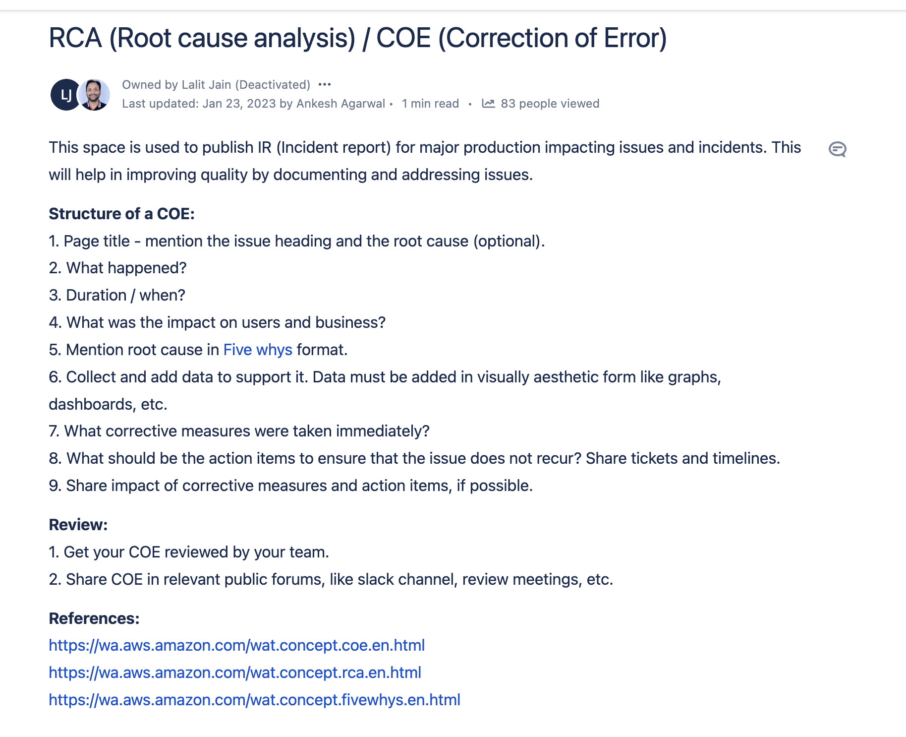

- [[tech]] [[learning]] [[techwriting]] [[rca]]
	- 
- [[book snippets]] [[books]] [[The Carpet People]]
	- #humourwriting "That's what I'm here to find out," said Careus. ***He spat on his hand and tried to flatten his hair a bit.***
	- [[word]] [[card]] Cud
		- partly digested food returned from the first stomach of ruminants to the mouth for further chewing.
	- [[word]] [[card]] Gratuitous
		- one without good reason; uncalled for.
		  logseq.order-list-type:: number
		- given or done free of charge.
		  logseq.order-list-type:: number
	- #humourwriting
	  
	  “It's how they work,” said Bane. “You know it. From inside. Like Jeopard. And the High Gate Land.”
	  **“What? Cucumbers?” said Glurk.**
	  “Yes, but not in Ware,” said Pismire. “Not here. I can't believe that. Not at the centre. Surely not?”
	  “Who would think of looking at the centre?” said Bane.
	  “If it comes to that, I wouldn't have expected them in Jeopard,” said Brocando.
	  **“Is this still about cucumbers?”**
	  “Yes, but not ... Ware,” said Pismire.
	  “You don't think so? I would have said the same about Jeopard,” said Brocando.
	  “Hardly anyone is allowed in the place these days,” said Owlglass.
	  **“It's not cucumbers you're talking about, is it?” said Glurk.**
	  “What can we do?” said Pismire.
	  **“Slice 'em!” said Glurk, waving a cucumber.”**
	- “Bane put his hand on his sword. “Yes,” he said. “I knew this would happen. Ware was a great city, once. **We fought for things. And when we got them ... we just sat back. No more effort. No more pride.** No more honesty. Just fat young Emperors and stupid courtiers. Well, I'm not having that. Not in Ware. Let's go.” He stood up.”
	- #realwordinfantasy #🤯
	  
	  Nothing will stop a pone going where it wants to go,” said Bane. “Or me!”
	  “I always wondered,” said Brocando, in the sudden silence, “and now I know.”
	  “Know what, for goodness sake?” said Pismire, thoroughly rattled.
	  “Why the Dumii conquered the Carpet,” said the king. “It was because, every once in a while, they thought like this.”
	- #humourwriting Cook's name is ***Mealy*** 🤣
	- Two guards stood to attention before they realised what they were doing.
	- #description #metaphors they [mouls] smelled like a fur coat that hadn't been brushed for too long.
	- #humourwriting I'm not hungry!” A human voice, but with a sulky whine in it that suggested that its owner had been given too many sweets when he was young and not enough shoutings-at. It was the kind of voice that's used to having its life with the crusts cut off.
	- #realwordinfantasy The civil war rages on,” another moul voice, “you have enemies on all sides. Only we can protect you. You must let us do that, sire.
	- They still did it, though,” said Brocando. “They still obeyed orders. Stupid. What would Deftmenes be if we went around obeying orders all the time?”
	  
	  “They might be ruling the Carpet,” said Pismire.
	- The mouls drew their swords and dashed towards him. **But four on to one was a disadvantage; it meant that each one was really waiting for one of the other three to make the first move.**
	- #humourwriting No. Arm the women,” said Brocando.
	  “Don't be stupid,” said Bane. “Women don't know how to fight.”
	  “Deftmene women do,” said Brocando.
	  “Oh, yes? Who with?”
	  “Deftmene men,” said Brocando.
	- #card #word Wallop
	  card-last-interval:: -1
	  card-repeats:: 1
	  card-ease-factor:: 2.5
	  card-next-schedule:: 2024-11-04T18:30:00.000Z
	  card-last-reviewed:: 2024-11-04T09:25:09.733Z
	  card-last-score:: 1
		- strike or hit very hard.
	- #humourwriting 🤣🤣🤣🤣🤣🤣🤣🤣🤣🤣🤣🤣🤣🤣🤣🤣🤣🤣🤣
	  
	  “Pismire said, “It might work, you know. Forewarned is forearmed.”
	  
	  There was silence. And then Brocando said, “Four armed? Does that mean we can hold twice as many swords?”
	- #humourwriting First, there was the question of weapons. Mealy took charge of that. Spears, for example. You tied a kitchen knife on the end of a stick and you couldn't tell the difference. Especially if it got stuck in you.
	- Glurk spent a lot of time helping them. Mealy said he was one of nature's sergeants, whatever that meant.
	- Pismire and Owlglass played a game. It consisted of moving little models of warriors around on a board made of squares. Pismire said he played because it concentrated the mind, and also because Owlglass bet heavily and wasn't very good.
	- #humourwriting #realwordinfantasy It's a funny thing. When there's a warning signal, when people have known for ever that there's a warning signal, and that warning signal is sounded for the very first time ... people don't react properly. They wander out blearily saying things like “Someone's mucking about with the warning signal, aren't they?” and “Who's blowing the warning signal? That's for warnings, that is.
	- #word #card Canter
		- a pace of a horse or other quadruped between a trot and a gallop, with not less than one foot on the ground at any time.
	- #humourwriting There had been archers all around the circle. Only in one place had the mouls been able to get right up to the ditch, and there were two fights going on-Deftmenes were fighting mouls, ***and other Deftmenes were fighting the first Deftmenes to get a chance to fight mouls too.***
	- #humourwriting Deftmenes had a technique for fighting enemies three times as high as they were-they'd run up them until they got to shoulder height, and hang on with one hand and fight with the other. ***It meant that half the mouls were stabbing at their own heads.***
	- #humourwriting
	  
	  They grouped around the hairs, and there were still too many of them.
	  “We could keep this up all day,” said Brocando.
	  “No we can't,” said Bane.
	  “We haven't lost anyone yet!”
	  ***“Yes, but do you want to go and ask the mouls if we can have our arrows back?” said Bane.***
	  ***“Oh.”***
	- #humourwriting
	  
	  No it isn't,” said Owlglass, who wasn't even being trusted to hold a sword. “I expect that having long sharp swords stuck in you is the worst part. Waiting's just boring. When I say boring, I mean-
		- #card #word melee
			- A confused fight or scuffle
	- > Madam! Hold it by the other end! Now, now, ladies, don't all push! Careful of that spear, you could do someone a mischief-
	  >
	  > “Isn't that the point, young man?” said an old lady who shouldn't have been anywhere near a battlefield.”
	  > “No, madam, that is the butt. The point is the sharp bit at the other end.”
	  >
	  > "Then out of the way, young man, so's I can use it."
	- This is SOOOOO cooooool #🤯
	  
	  The women weren't the most efficient fighters Bane had ever seen, but Brocando had spent a couple of days giving them some secret training. Mealy had helped, too. And they were keen. Besides, not having been trained as proper soldiers was even a help. Dumii soldiers learned their tic-toe sword drill, and weren't up to novel ways invented as you went along, like hitting an enemy across the back of the knees with the end of a spear and stabbing him as he fell over. The women fought nastier
	- And then there was one, and only one. She was amazed. Normally futures came in bundles of thousands, differing in tiny little ways. But this one was all by itself. It barely existed. It had no right to exist. It was the million-to-one chance that the defenders would win.
	  
	  She was fascinated. They were strange people, the Dumii. *They thought they were as level-headed as a table, as practical as a shovel-and yet, in a great big world full of chaos and darkness and things they couldn't hope to understand, they acted as though they really believed in their little inventions, like “law” and “justice”.* **And they didn't have enough imagination to give in**.
	- Bane said: “I don't expect the mouls have much interest in history. After this, no more books. No more history. No more history books.”
	  
	  “Somehow, that's the worst part,” said Snibril.
	  
	  “Excuse me,” said one of the women. “Er. I am Lady Cerilin Vortex. Widow of the late Major Vortex?”
	  “I remember him. A very honourable soldier,” said Bane.
	  
	  ***I'd just like to say that no more history books is not the worst part, young man. Dying's probably the worst part,” said Lady Vortex. “History will look after itself.***
	- #🤯 
	  
	  I'm sure we're very ... um ... grateful that you have assisted,” said Bane, awkwardly.
	  
	  ***We haven't assisted, we've taken part,” said Lady Vortex sharply.***
	- She turned to Bane. “And when we get out of this, young man,” she snapped, “there's going to be some serious talking. If we're going to fight, we're going to have a bit of the future too-”
	- Jornarileesh opened his mouth, and then shut it again. Snibril stared at the pair of them. ***He'd do it, he thought. Here and now. Not out of cruelty or rage, but because it needed to be done.***
	- #🤯 #realwordinfantasy 
	  
	  Snibril's right, though,” said Pismire, as the silent moul was hurried off. “Everyone's done things the old way. Now we'll have to find a new way. Otherwise there won't be any way. We don't want to have to go through all this just to start squabbling over something else. The Empire-”
	  
	  “I'm not sure there's going to be an Empire again,” said Bane.
	  
	  “What? But there's got to be an Empire!” said Pismire.
	  
	  “There might be something better,” said Bane. “I'm thinking about it. Lots of small countries and cities joined together could be better than one big Empire. I don't know.”
	  
	  “And a voice for women,” said Lady Vortex's voice from somewhere in the crowd.
	  
	  “Possibly even that,” he said. “There should be something for everyone.”
	- I'm sure people are going to sort things out,” said Snibril.
	  
	  “So long as they never stop arguing,” said Pismire. “Very important, arguing.”
	- #🤯
	- Did you know the wights think we're courageous because we can make decisions? They can't do it! 
	  
	  They can't cope with it! And we thought they were special. Amazing what you learn.
	- #❤️
	- > He [Snibril] felt a little sad. But there would always be somewhere to return to, somewhere.
- [[Things Written At Other Places]] [[Jan 22nd, 2023]] [[learning]] [[life]]
	- ## Things Learn From Amma When She Vented Before Going Back To Chandigarh
	- Respect in the family comes form constant communication.
	- Call People
	- A character trait, say sensibility, is of no use, if not put in practice with people
	- Open oneself to learn from family members. Do not make unnecessary conflict it with independence, will, ambition and desire.
- [[knowledge]]
	- Freeze the [[intellect]]. At the peak of any experience mind gets frozen
		- When someone gets angry it's difficult to talk, you fumble
		  logseq.order-list-type:: number
		- Sex -> Intellect freezes
		  logseq.order-list-type:: number
		- Delusion -> Intellect freezes
		  logseq.order-list-type:: number
- [[Aryamann]] [[therapy]] [[person]]
	- After he feels better ask him — what were his ideas going abroad?