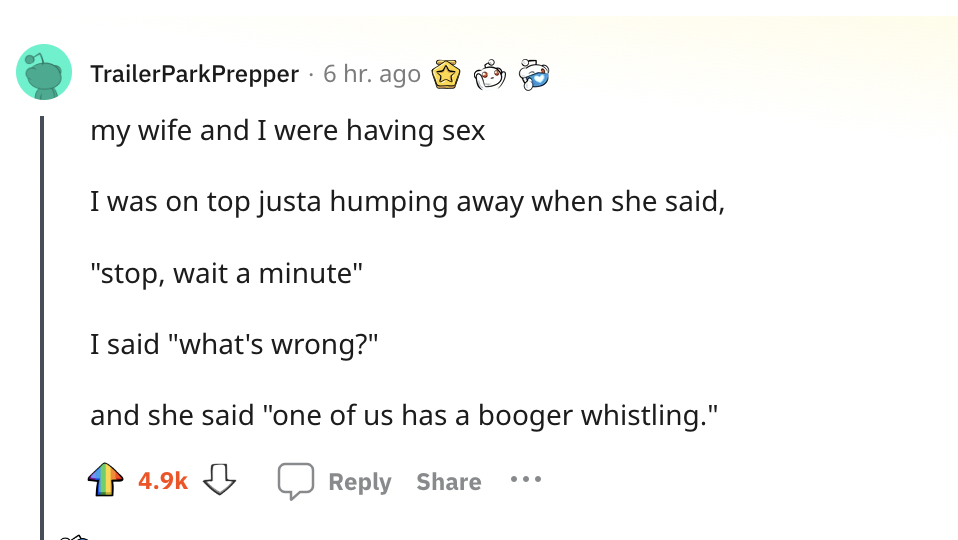

- [[phrase]] "Glow on the lips after smearing of the saliva on them"
	- [[humourwriting]] [[reallifedialogues]]
	  > “It’s so nice to grope. The voluptuousness of the expression put rightly. I still do with my mother.”
	  — K, Wed, 19th July, 1:26AM
- [[learning]] [[OG]] [[tech]]
	- `https://bitbucket.org/indwealth/stencil/src/master/revamp/reusable-hooks/use-dynamic-nav/README.MD`
- [[humourwriting]] [[humour]] [[reddit]]
	- https://www.reddit.com/r/AskReddit/comments/152zpp7/comment/jsgt9tc/
	- 
- [[card]] [[word]] Foyer
	- Lobby, corridor, or waiting room used in a theatre, cinema, concert, hall