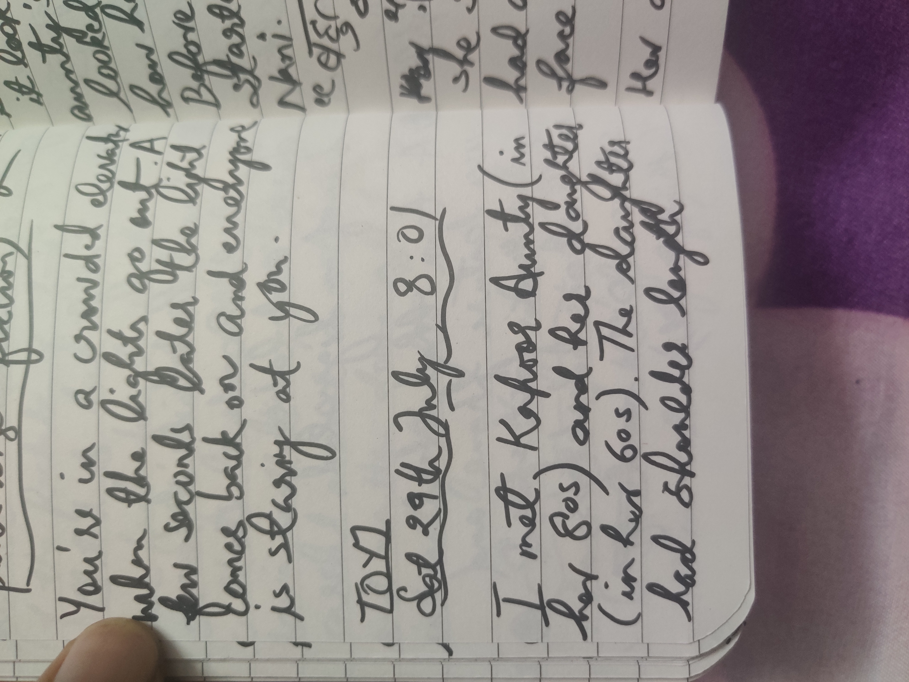
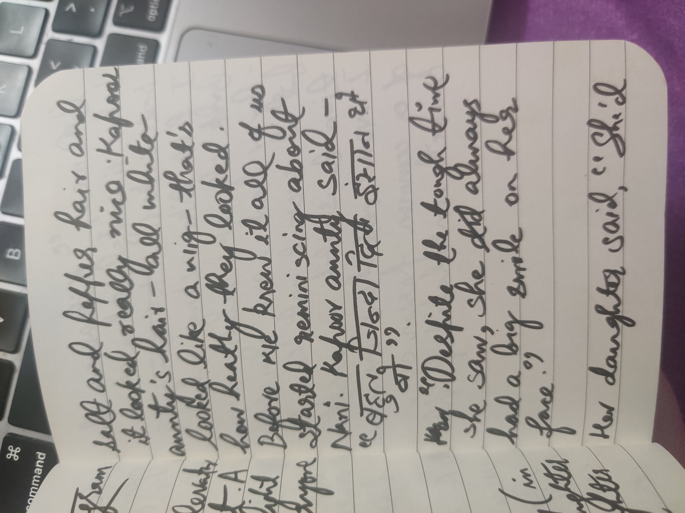
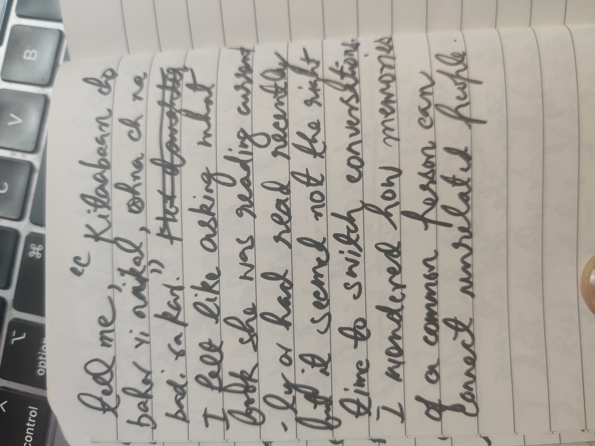

- [[course:cssforjs]]
	- > Please note, you shouldn't actually set a `px` font size on the `html` tag. This will override a user's chosen default font size. If you really want to change the baseline font size for rem units, you can do that using percentages:
	  
	  ```html
	  html {
	    /* 20% bigger `rem` values, app-wide! */
	    font-size: 120%;
	  }
	  ```
	- ```
	  <b> and <i>?
	  Before we had <strong> and <em>, we had <b> (for bold) and <i> (for italic). When HTML5 came around and introduced semantic markup, these two tags were deprecated.
	  
	  In the years since, however, these tags have been un-deprecated, and given new semantic meaning:
	  
	  <b> is used to draw attention to text without implying that it's urgent or important.
	  <i> is used to highlight “out of place” content, like a foreign word, or the internal thoughts that a character is having in fiction.
	  Now, I'll be honest: I rarely use <b> and <i> myself. I don't know why you'd want to draw attention to something that isn't important. And it isn't clear to me what the semantic benefits are of the <i> tag.
	  
	  It is important to use semantic HTML, and we'll see plenty of examples throughout this course. My personal opinion is that I'd rather focus on higher-impact things.
	  ```
	- We can calculate the actual height of each line by multiplying the font size (2rem) by the line-height (1.5), for a derived value of 3rem.
	  
	  ```html
	  p {
	    font-size: 2rem;
	    line-height: 1.5;
	  }
	  ```
	  
	  By default, browsers come with a surprisingly small amount of line height. In Chrome, the default value is `1.15`. In Firefox, it's `1.2`.
	  
	  These default values produce densely-packed lines of text which can be hard to read for people who are dyslexic or have poor vision. **To comply with accessibility guidelines, our body text should have a minimum line-height of 1.5.** This is according to [WCAG 1.4.12, Text Spacing guidelines](https://www.w3.org/WAI/WCAG21/Understanding/text-spacing.html).
	- As we saw earlier, these are the “built-in” styles for `<a>` tags:
	  
	  ```css
	  a {
	    color: -webkit-link;
	    cursor: pointer;
	    text-decoration: underline;
	  }
	  ```
	  
	  The trouble is that even though `color` is an inheritable property, **it's being overwritten by the default style**, `color: -webkit-link`?.
	  
	  We can fix this by explicitly telling anchor tags to inherit their containing text color:
	  
	  ```html
	  <style>
	    a {
	      color: inherit;
	    }
	  </style>
	  
	  <p>
	    This paragraph contains <a href="#">a hyperlink</a>!
	  </p>
	  <p style="color: red;">
	    This is a red paragraph with <a href="#">another link</a>.
	  </p>
	  ```
	- These alternatives are known as ***logical properties***
	  
	  ```css
	  p {
	    display: block;
	    margin-block-start: 1em;
	    margin-block-end: 1em;
	    margin-inline-start: 0px;
	    margin-inline-end: 0px;
	  }
	  ```
	-
- [[card]] [[word]] philanderer
	- a man who readily or frequently enters into casual sexual relationships with women; a womanizer
- [[card]] [[word]] aspersion
	- an attack on the reputation or integrity of someone or something
- [[card]] [[word]] indissolubly
  card-last-interval:: 4
  card-repeats:: 1
  card-ease-factor:: 2.36
  card-next-schedule:: 2024-11-08T09:25:04.430Z
  card-last-reviewed:: 2024-11-04T09:25:04.431Z
  card-last-score:: 3
	- unable to be destroyed; lasting: *an indissoluble friendship*.
- [[card]] [[word]] ingenious
	- (of a person) clever, original, and inventive:
- [[card]] [[word]] Wall-eye
  card-last-interval:: -1
  card-repeats:: 1
  card-ease-factor:: 2.5
  card-next-schedule:: 2024-11-04T18:30:00.000Z
  card-last-reviewed:: 2024-11-04T09:24:56.803Z
  card-last-score:: 1
	- an eye with a streaked or opaque white iris.
		- an eye squinting outwards.
- [[card]] [[word]] contingent
	- Subject to chance.
	- _"What we have," he said early on to De Beauvoir, "is an essential love; but it is a good idea for us also to experience contingent love affairs."_ — [Source](https://www.theguardian.com/world/2005/jun/10/gender.politicsphilosophyandsociety)
- [[toyj]] [[literature]] [[writers]] [[readtoday]] [Did Simone de Beauvoir's open 'marriage' make her happy?](https://www.theguardian.com/world/2005/jun/10/gender.politicsphilosophyandsociety)
	- *Then, too, there was Sartre's important dictum of "transparency" - the vow that they would never lie to each other the way married couples did. They would tell each other everything, share feelings, work, projects.*
	- *Between the lines of her fiction and what are in effect six volumes of autobiography, it is also evident that De Beauvoir suffered deeply from jealousy. She wanted to keep the image of a model life intact*
- [[card]] [[word]] seamy
	- sordid and disreputable: *a seamy sex scandal*.
- [[card]] [[word]] Bluestocking
  card-last-interval:: -1
  card-repeats:: 1
  card-ease-factor:: 2.5
  card-next-schedule:: 2024-11-04T18:30:00.000Z
  card-last-reviewed:: 2024-11-04T09:24:45.600Z
  card-last-score:: 1
	- An intellectual or literary woman
- [[card]] [[word]] edifice
	- a complex system of beliefs.
- [[card]] [[word]] risque #sexualwords
	- slightly indecent and liable to shock, especially by being sexually suggestive
- [[story:generalidea]]
	- sex in the fog
- [[people]] [[nani]] [[toyj]] [[memories]]
	- 
	- 
	- 
	- Nanu and Amma talked about the time in Mandi I believe when Nani and Dogra aunty were on a movie spree and Massi and Amma would be brought in from school and dress changed right outside of the movie theatre.
	- Nanu's manner of saying *This daal is all watery* —  ***Eh ki shambhu paani banaa ditti aa***