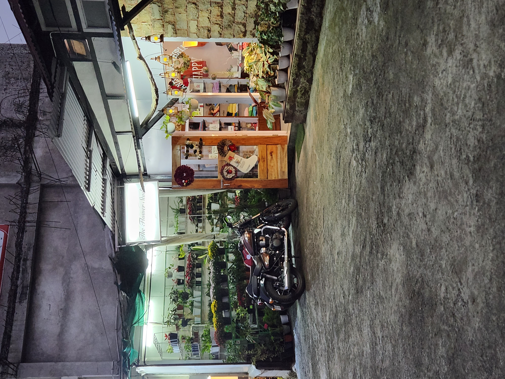
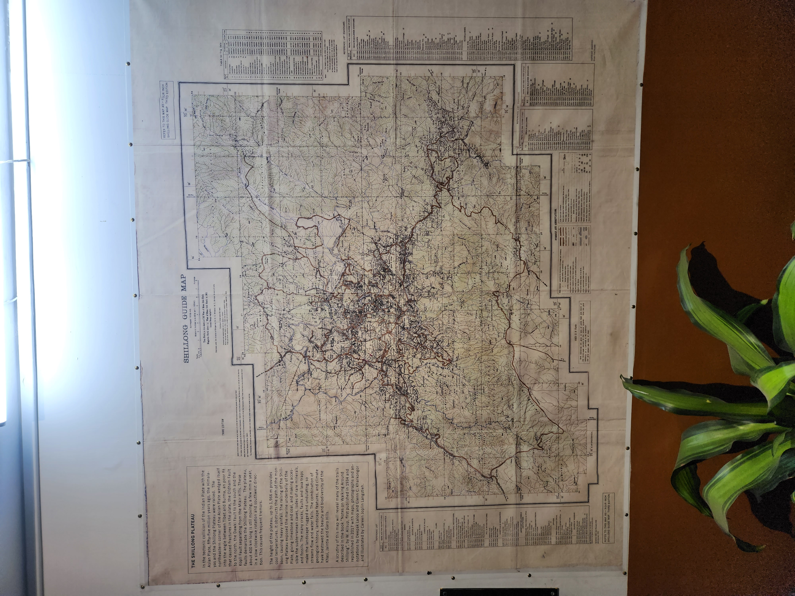
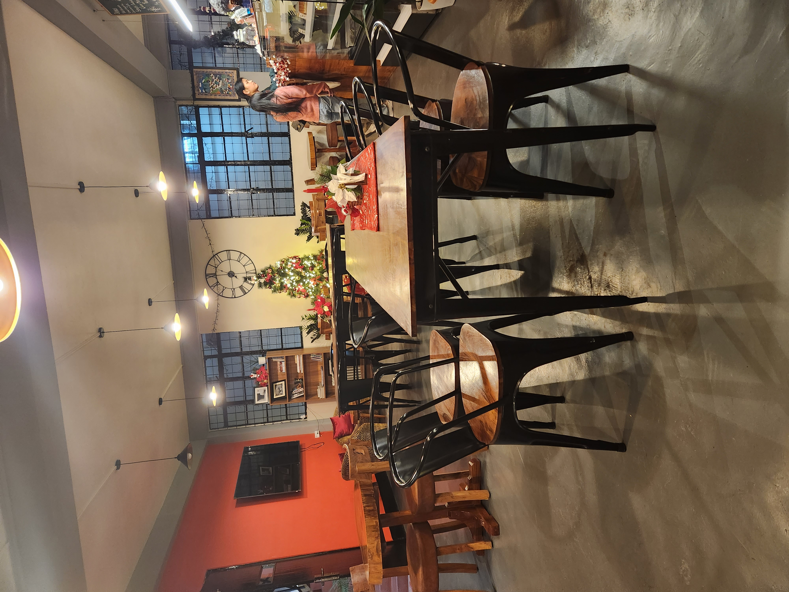
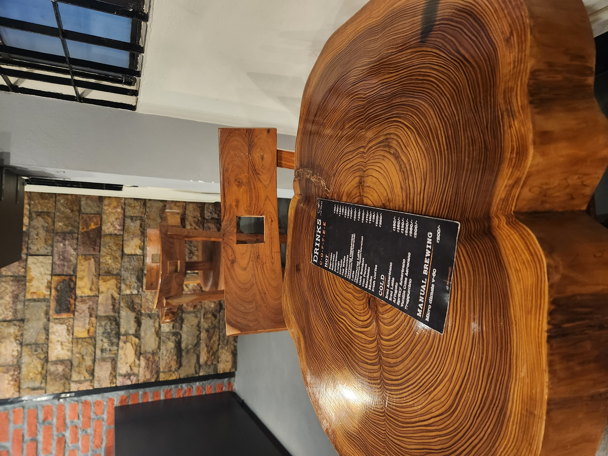
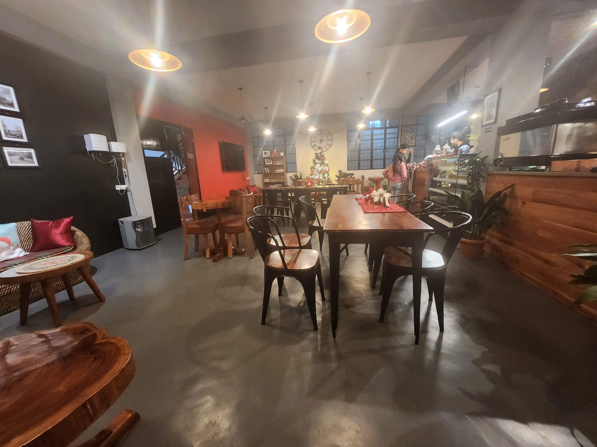
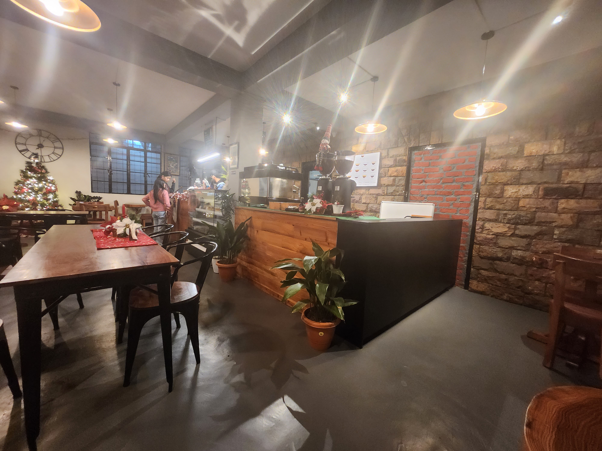
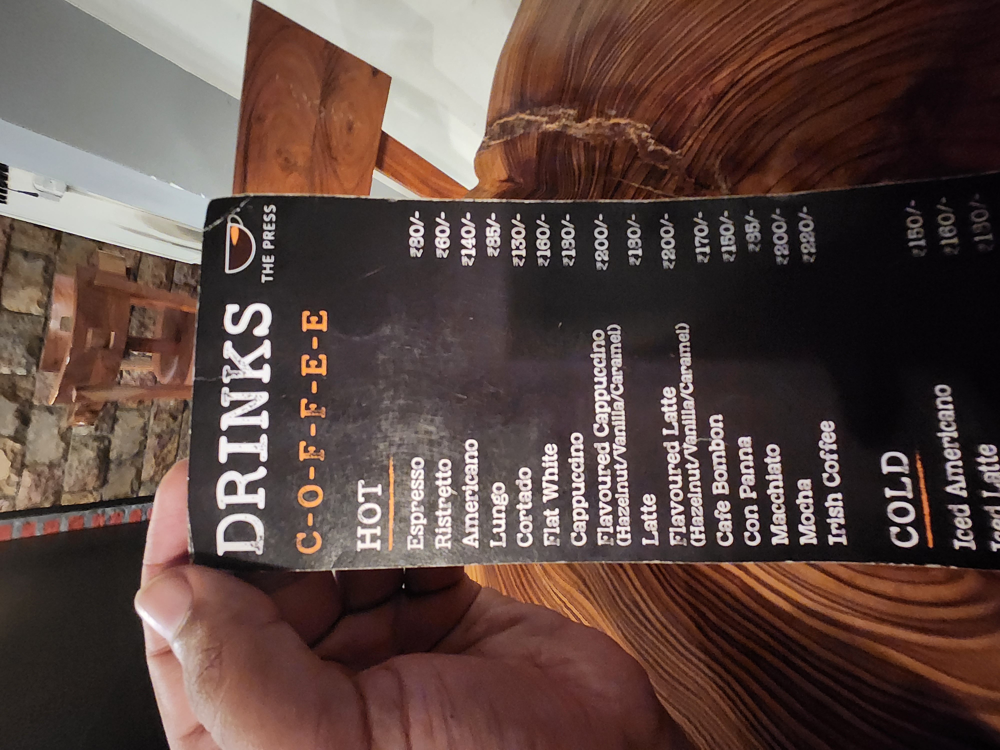
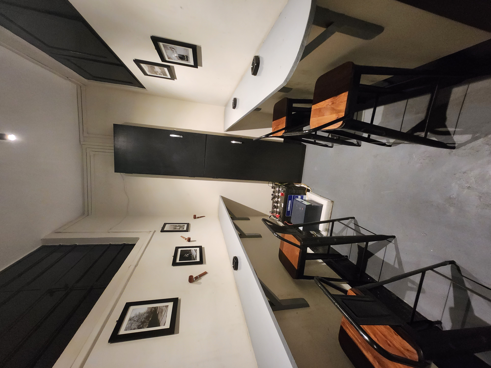
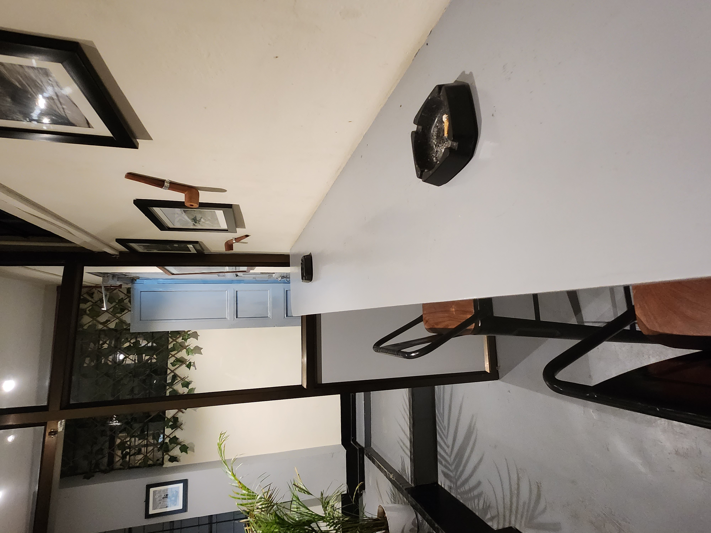

- [[toyj]]
	- When I am thinking, I have a parallel mind that keeps noting the thoughts down, '_this will be worth writing about_'. Last four days, my mind has overdriven. In the middle of doing something, thoughts of morality would come — situations where I'm panicking and running not knowing what to do about something happening to father. I'd feel guilty that in that hypothetical fear world, the first scare that comes if of '_I wouldn't know what to do about property and money and possible takeovers that distant relatives would try to snatch it all up_'. Father has been ill for some time. UTI and his sugar rising because of it. Having not have to ever have any idea about an ill parent and their medicines, this has been scary. Seeing father freeze while I kept asking for 10seconds straight, '_Appa kya hua?_' and then rush to the bathroom, vomiting in the air a little mid way and then over a toilet seat was scary. I was calm throughout, perhaps low-key scared. In the night, I'd try to be vigilant, '_I'll be awake and keep going to his room to see if it's okay,_', and then I'd think to not, that it was necessary that he slept properly. Frisky feelings didn't come near at all. One day when I was going to bathe, I thought I'd masturbate, but then the cloud of the thoughts of morality thought previously came wordlessly and said 'no'. I'd feel guilty about when I wouldn't be able to enforce taking medicine on time. _My #daadi can't take care of everything_. It was when me and #daadi were cooking together ( that was fun and I'll link that here ) and when I realised that she had put extra oil in the pan that I realised that I'll have to just be mindful generally of things in the house — food and medicines mostly. So I created a chart of medicines, got up early today ( couldn't get early the days before, because of sleeping late). I couldn't sleep, morality thoughts would bombard, I'd stop them, try to read, but couldn't, try to watch something, like Big Bang Theory and some punches would leave me grinning and I'd thank for it. I started stretching thinking that I didn't want to be dependent on anybody in my old age. This impression has solidified
	- [[appa]] would often ask me to forward some song that'd be playing. Like Chand Mera Dil Chaandani Ho Tum.
	- #funny #memory. #daadi told that the first telephone installed in the house, #appa's paternal grandmother picked up the phone upside down and said '_chalo? chalo__'. #daadi said, 'when we asked what she was doing she said, _don't you folks keep doing chalo chalo (hello, hello) after picking up the phone?'
	- I got to know that by a wild paper napkin math guess, our forefathers ( my father's father's father's father's generation ) migrated from Rajasthan to Himachal perhaps sometime in 1880s / 1890s.
	- My grandfather were 6 brothers and 2 sisters.
	- There's something in the spaces of small cafes in hill towns and cities like Shillong that makes you want to sit and write. In a place specially like Shillong, although I've not been here much, from the two days that I went out to walk for a couple of hours each, I realised that people here are super nice and welcoming. I went to one of the places suggested by Janice Pariat ( to Amrita, for me ) called The Press. The place was mostly empty. Perhaps I was early ( 5pm ). Tables were super nice to sit on and it was an instant mahual to write, but I didn't have either paper or pen, so I drank and ate. 4 interesting foreigners came and greeted the cafe's owner, asking how he was and making small talk. It was so nice to see. It made me see how I interact with people. Perhaps they had become regulars. I wonder what they did here if they were. 'Missionaries,' my father said, but I don't know why I doubt it. Because
		- The first one came and sat in front of me, ordered coffee.
		- The second one came, greeted the first  one, but sat on his own table.
		- The third came and were to sit with the first one, when she asked the second one why he was sitting alone. All three of them went to the second person's table
		- I left after paying for coffee and tacos. I had left my umbrella. When I came back, there was a fourth one, a local, with black clothes. He was talking in sign language. I wonder what they were doing.
		- The Press Cafe Photos
		  collapsed:: true
			- 
			- 
			- 
			- 
			- 
			- 
			- 
			- 
			- 