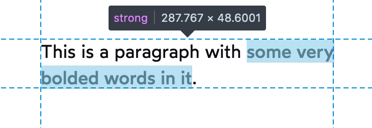
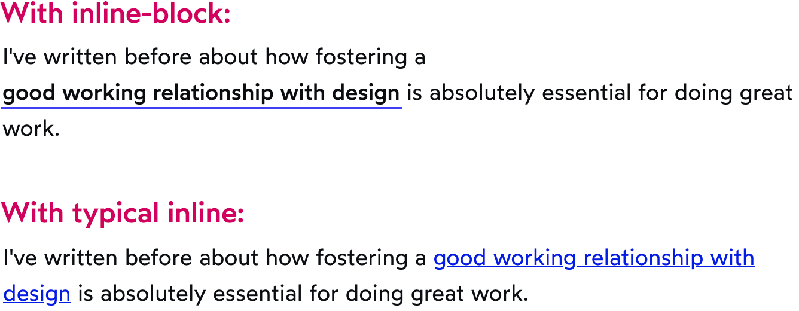
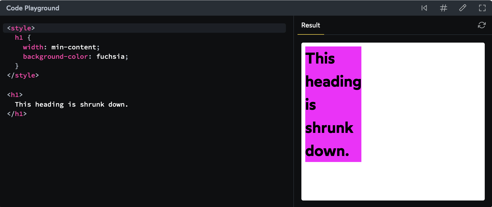

# Inline behaviour is exempted for replaced elements

foreign/replaced elements `img`, `video`, `canvas` despite being inline can have margin top, bottom, height set on them.

> How do we reconcile this? I have a trick. I like to pretend that it's a foreign object within an inline wrapper. When you pass it a width or height, you're applying those properties *to the foreign object*. The inline wrapper still goes with the flow.
- 
	- The image is 300px tall, but its parent `<div>` is 306px tall. Where are those extra few pixels coming from?? It's not padding, it's not border, it's not margin…
	- The reason for this extra “magic space” is that the browser treats inline elements as if they're typography. It makes sense that with text, you'd  want a bit of extra space, so that the lines in a paragraph aren't  crammed in too tightly.
	- Two ways to fix
		- Set images to `display: block` — if you're noticing this problem, there's a good chance your images aren't interspersed with text, so setting them to display as blocks makes sense.
		- Set the `line-height` on the wrapping div to `0`:
- # Whitespaces in html for flow layout
  
  ```html
  
  
  
  ```
  the above adds an inline whitespace, but the whitespace goes away if html is squished together without whitespace because: 
  
  > HTML is *space-sensitive*, at least to an extent. The browser can't tell the difference between whitespace added to separate words in a paragraph, and whitespace added to indent 
  our HTML and keep it readable.
  
  ***This is a flow layout specific problem***. Other layout algos like flexbox, ignore whitespace altogether
- # ***SUSHI Roll:***
  inline elements can line-wrap, which means they can have shapes other than rectangles (unlike block elements)
	- 
	- it's the reason why some properties like vertical margin don't apply to inline ( because what would it even mean for this shape?)
	- ***inline-block***: We can think of `inline-block` as *“a block in inline's clothing”*.
		- ```html
		  <style>
		    strong {
		      display: inline-block;
		      color: white;
		      background-color: red;
		      width: 100px;
		      margin-top: 32px;
		      text-align: center;
		    }
		  
		    strong:hover {
		      transform: scale(1.2);
		    }
		  </style>
		  
		  <p>
		    <strong>Warning:</strong> Alpaca may bite.
		  </p>
		  ```
		  
		  the strong here gets the super powers of block ( being able to set margin-top and width in this example), but the browser puts it inline against other text. 🤯
		- ## ***CATCH:*** *INLINE BLOCK ELEMENT DOESN'T LINE WRAP!!!*
			- 
			- You may be tempted to pick really-short link text, to avoid this problem, but that would be a mistake; descriptive link text is [important for accessibility](https://www.a11yproject.com/posts/2019-02-15-creating-valid-and-accessible-links/). Therefore, we should only use effects like this when the links aren't part of a paragraph (eg. navigation links).
- # Making `a` tags accessible
	- write helpful link text
		- ❌
			- `To see our documentation <a href="/README.md">click here</a>.`
			- `<a href="/full-article">Read more</a>.`
		- ✅
			- `We have made our <a href="/README.md">documentation</a> available.`
			- `<a href="/full-article">Read more - Accessible Landmarks</a>`
	- Don't use title attribute: it's not exposed in useful ways by browsers to keyboard or touch only devices.
	- Never remove outlines on focus
	- Don't override visiting the link on `enter` key hit behaviour
	- ### When to use button?
		- if a element has
			- empty or no `href`
			  logseq.order-list-type:: number
			- Scripting attached via the `onClick` attribute or listeners.
			  logseq.order-list-type:: number
			  
			  This will probably be triggering an action on the same page, such as 
			  opening a menu or toggling content and as such is a much better 
			  candidate for the `<button>` element.
		-
- # Width Algorithms
- By default block elements have *dynamic sizing* ( auto )
- percentage based widths, those % are based on the parent element's content space.
- measurement and `auto` are ***extrinsic***. `min-content` is ***intrinsic*** because it depends on the element(and its children) instead of element's parent
- ***`min-content`***: we're specifying that we want our element to become as narrow as it can, *based on the child contents*
	- 
- ***`max-content`***: *never* adds any line-breaks. The element's width will be the smallest value that contains the content, without breaking it up. It[browser] will size the element based purely on the length of its unbroken children.
- `fit-content`: If that width can fit within the parent container, it behaves just like `max-content`, not adding any line-breaks. If the content is too wide to fit in the parent, however, it adds line-breaks as-needed to ensure it never exceeds the available space. It behaves just like `width: auto`.
- ***Gotcha of width vs height:*** when we don't set width and height explicitly, **by default, width looks *up* the tree, while height looks *down* the tree.** An element's width is calculated based on its *parent's size*, but an element's *height* is calculated based on its *children*.
- ***Caveat with using vh for the purpose that height: 100% is used on html, body and wrapping element:***
	- When you scroll on a mobile device, the address bar and footer controls slide away, yielding their space to the content. This means that scrolling on a mobile device changes the viewport height.
	- To avoid flickering UI issues, browsers like iOS Safari and Chrome Android will set `vh` equal to the *maximum viewport height*, after scrolling. This means that when the page first loads, `100vh` will actually be quite a bit taller than the viewable area.
	- Example of this vh behavior ( open in mobile )
		- [courses.joshwcomeau.com/demos/full-height-vh](https://courses.joshwcomeau.com/demos/full-height-vh)
		- [courses.joshwcomeau.com/demos/full-height-percentage](https://courses.joshwcomeau.com/demos/full-height-percentage)
	- Better today to do:
	  
	  ```css
	  .element {
	    height: 100vh; /* Fallback for older browsers */
	    height: 100svh;
	  }
	  ```
	  
	  But still important to know how percentage based with and height work.
	-