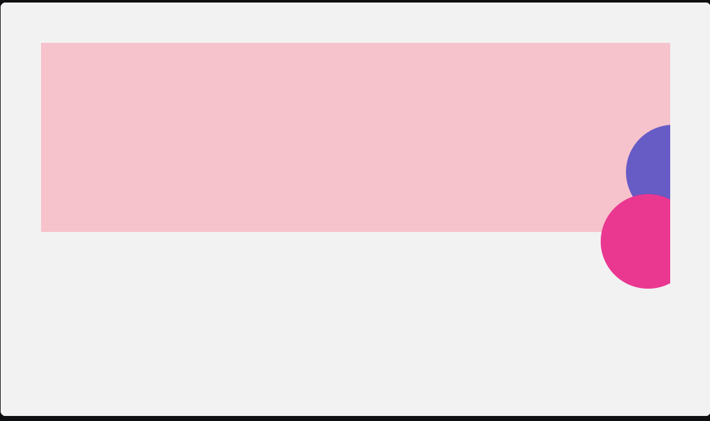

- [[course:cssforjs]]
	- # Managing z-index
	- ## Swapping DOM Order
	  logseq.order-list-type:: number
		- If we don't specify a z-index, the browser will paint positioned elements based on their DOM order.
		- > ⚠️ **Be careful with this strategy!  (warning)**
		  Swapping the DOM order to control rendering can be a very useful trick, but it isn't always appropriate.
		  >
		  > When we swap the order of two DOM nodes, we also swap their order in the tab index. For folks who navigate with a keyboard, they encounter elements *based on the DOM order*.
		  >
		  > In the example above, this isn't a problem, since the decorative images  aren't interactive. Keyboard users will skip right past them no matter where in the DOM they are.
		  >
		  > But if we were to swap the order of an element containing *interactive* elements — links, buttons, form inputs — it can have a jarring effect on the user experience for keyboard navigators.
	- ## Isolated stacking contexts
	  logseq.order-list-type:: number
		- example: 3 pricing cards with middle one zoomed up with shadow
		- done with z-index, but header breaks
		- so we create an isolated stacking for cards container with z-index 1 so that it doesn't clash with header's z-index 2 and position relative ( because remember z-index only work on positioned elements, and not on flow layout-ed elements)
			- better option for doing this: `isolation: isolate` instead of `position: relative; z-index: 1`;
			- This is especially valuable in the era of component-driven frameworks. Our application might have a `Pricing` component that renders our group of cards, and we might use that component in multiple places. This way, we aren't prescribing a z-index value to be used *everywhere*. Ever since discovering the `isolation` property, I've been using it a ton. Whenever a child within a component applies a `z-index` value, I add `isolation: isolate`to the component's parent element. This guarantees that we won't see weird "slip-in-between" bugs, like the one we saw with the sticky header. But it doesn't contribute at all to z-index inflation, or force me to pick a value.
	- # Fixed Position
	- absolute but can only be contained by viewport, can't be contained by any other containing block.
	- ## Incompatibility with certain CSS properties
	- Certain CSS properties, when applied to an ancestor, will mess with fixed positioning.
	- For example, if an ancestor (parent, grandparent, …) uses the `transform` property, it stops being locked to the viewport:
		- **Here's what's happening here:** By applying a transform to `.container`, it becomes the containing block for this fixed-position child. ***As a result, it functions like an absolutely-positioned child.***
		- same thing happens with `filter`, `will-change` properties.
		- http://meyerweb.com/eric/thoughts/2011/09/12/un-fixing-fixed-elements-with-css-transforms/
	- # Overflow
	- Adding detailed comments when using `overflow: hidden` is absolutely critical. Otherwise, you'll never remember why you set the property. If you refactor this property away, it won't be immediately obvious that you've broken something; it only causes problems on mobile, and this is primarily a desktop application.
		- ## Scroll Containers
		- When a child is placed in a scroll container, it *guarantees* that the child will never spill outside of it. It's on the other side of the portal! Either a child *is* or *isn't* in a scroll container. We can't mix and match for vertical/horizontal. **Critically, this is true regardless of whether we set `scroll`, `auto`, or `hidden`.** All 3 values have the same effect: it creates a scroll container. But wait… Why would `hidden` create a scroll container? It makes sense that `scroll` and `auto` would create a scroll container, but we can't scroll within an `overflow: hidden` element!** Here's the trick:** `overflow: hidden` is identical to `overflow: scroll`, *but with the scrollbars removed.
	- `overflow:clip`: doesn't create a scroll container, but works like overflow:hidden. Any content that spills outside the bounds of this containing block is made invisible.. so this is possible –
		- ```html
		  <style>
		    .wrapper {
		      overflow-x: clip;
		      background: pink;
		    }
		  </style>
		  
		  <div class="wrapper">
		    <div class="flourish one"></div>
		    <div class="flourish two"></div>
		  </div>
		  ```
		  
		  ```css
		  body {
		    background: hsl(0deg 0% 95%);
		    padding: 32px;
		  }
		  
		  .wrapper {
		    position: relative;
		    height: 150px;
		  }
		  
		  .flourish {
		    position: absolute;
		    border-radius: 100px;
		    width: 75px;
		    height: 75px;
		  }
		  .flourish.one {
		    background: slateblue;
		    right: -40px;
		    bottom: 10px;
		  }
		  .flourish.two {
		    background: deeppink;
		    right: -20px;
		    bottom: -45px;
		  }
		  ```
		- 
		- That's not the only catch, either. If the container has a `border-radius` set, it will force the clipping to happen in both directions in certain browsers ( firefox handles well, chrome doesn't and will act as overflow-hidden)
		- if we use overflow:clip on a wrapper containing list of things with max-height set. Because no scroll container is created, the final (last) couple of links won't be made visible upon focus. As we tab through the list, the focus indicator becomes invisible, and we have no idea what we're selecting.
	- ### Solving the problem without overflow-clip ( since it's relatively new with the above caveat )
		- ```html
		  <style>
		    html, body {
		      height: 100%;
		    }
		    .outer-wrapper {
		      overflow-x: hidden;
		      min-height: 100%;
		      /*
		        Adding a border so you can see the
		        size/shape of this container:
		      */
		      border: 2px dashed silver;
		    }
		    .wrapper {
		      background: pink;
		    }
		  </style>
		  
		  <div class="outer-wrapper">
		    <div class="wrapper">
		      <div class="flourish one"></div>
		      <div class="flourish two"></div>
		    </div>
		    <p>Hello world</p>
		  </div>
		  ```
		- ```css
		  body {
		    background: hsl(0deg 0% 95%);
		    padding: 32px;
		  }
		  
		  .wrapper {
		    position: relative;
		    height: 150px;
		    border-radius: 8px;
		  }
		  
		  .flourish {
		    position: absolute;
		    border-radius: 100px;
		    width: 75px;
		    height: 75px;
		  }
		  .flourish.one {
		    background: slateblue;
		    right: -40px;
		    bottom: 10px;
		  }
		  .flourish.two {
		    background: deeppink;
		    right: -20px;
		    bottom: -45px;
		  }
		  ```
		- summary: an outer wrapper is made overflow:hidden instead of wrapper.
		- ## Horizontal Scroll
		- `white-space:nowrap` with `overflow:auto`
		- ## Positioned Layout
		- Absolutely-positioned elements act just like static-positioned elements when it comes to overflow. If the parent sets `overflow: auto`, *as long as that parent is the containing block*, it will allow that child to be scrolled into view. This is pretty surprising! In general, absolute positioning is ignored by standard layout algorithms, and yet `overflow: auto` treats it just like any other element!
		- In order for a child to "trigger" the overflow, it needs to be contained by it. so position:fixed children can't be contained by overflow:auto or overflow:hidden because they are not contained by their parent, but by viewport.
	- # Sticky Positioning
	- Stays in the box of its parent container.
	- Sticky elements are like relative or static elements in this regard; they're laid out in-flow. They take up real space, and that space remains taken even when the element is stuck to an edge during scrolling. ***Sticky elements are considered "in-flow", while fixed elements aren’t.***
	- when it comes to sticky positioning, elements stick *to the closest scroll container.*
	- ## TroubleShooting
	- find sticky culprit parent
		- ```js
		  // Replace “.the-sticky-child” for a CSS selector
		  // that matches the sticky-position element:
		  const selector = '.the-sticky-child';
		  
		  function findCulprits(elem) {
		    if (!elem) {
		      throw new Error(
		        'Could not find element with that selector'
		      );
		    }
		  
		    let parent = elem.parentElement;
		  
		    while (parent) {
		      const { overflow } = getComputedStyle(parent);
		  
		      if (['auto', 'scroll', 'hidden'].includes(overflow)) {
		        console.log(overflow, parent);
		      }
		  
		      parent = parent.parentElement;
		    }
		  }
		  
		  findCulprits(document.querySelector(selector));
		  ```
		- If the culprit uses `overflow: hidden`, we can switch to `overflow: clip`. Because `overflow: clip` doesn't create a scroll container, it doesn't have this problem!
		- If the culprit uses `auto` or `scroll`, you *might* be able to remove this property, or push it lower in the DOM. This is a tricky problem, often without a quick solution. We saw an example of this sort of restructuring in the [solution to the last exercise](https://courses.joshwcomeau.com/css-for-js/02-rendering-logic-2/16-sticky-exercises#two-fix-the-bug).
		- Make sure that your sticky element has room to move within its parent container.
			- flex, grid: When using Flexbox or Grid, it's possible for a sticky element to be stretched along the cross-axis. This, in effect, makes it so that the 
			  element has no space to move in its parent container.
		- Make sure that the scroll container is actually scrollable, if it isn't sticky element doesn't have a place to ***stick to***
		- ### There's a thin gap above my sticky header!
			- If you intend for an element to sit right against the edge of the viewport, you might discover a thin 1px gap between the element and the 
			  edge in Chrome. This is a rounding issue with fractional pixels. I've solved this issue by insetting the sticky element by a single pixel:
			- ```css
			  header {
			    position: sticky;
			    top: -1px; /* -1px instead of 0px */
			  }
			  ```
	- # Hiding Stuff
	- display: none
	- visibility: hidden -> It's like a cloak of invisibility; the item can't be seen, but it's still there, taking up space. This property isn't as commonly used, because generally you don't want a big hole in your UI! But sometimes, it's helpful to be able to "hold space open" for an element that will soon become visible (The show hide answer on focus, hover example)
		- layout is retained
		- ### selectively undone by children
			- ```html
			  <style>
			    section {
			      visibility: hidden;
			    }
			  
			    .button.two {
			      visibility: visible;
			    }
			  </style>
			  
			  <section>
			    <button class="button one">
			      First Button
			    </button>
			    <button class="button two">
			      Second Button
			    </button>
			    <button class="button three">
			      Third Button
			    </button>
			  </section>
			  ```
			- In this example, we've hidden the parent `section`, but chosen to reveal a specific child, the second button. This is *unusual*;  the same can't be done with any of the other methods on this page. Usually, when a parent is hidden, all of its children will also be hidden, and there's no way around it.
	- opacity:
		- Unsurprisingly, hiding an element with opacity does not remove it from flow. In fact, items hidden with opacity aren't *really* hidden:
			- Buttons can still be clicked
			- Text is still selectable
			- Form elements can still be focused
		- If we're not careful, we can introduce accessibility issues: imagine we hide a set of buttons, but keyboard users will still be able to tab through them, without knowing where their focus is! ***Opacity on its own is not a great way to hide something from view.***
		- Opacity is helpful when:
			- An item needs to be semi-visible
			- An item's visibility needs to be animated, fading in and out
	- # Accessibility
	- ## Hide from screen but not from screen readers
	- ```css
	  .visually-hidden {
	    position: absolute;
	    overflow: hidden;
	    clip: rect(0 0 0 0);
	    height: 1px;
	    width: 1px;
	    margin: -1px;
	    padding: 0;
	    border: 0;
	  }
	  ```
	- explanation: https://www.joshwcomeau.com/snippets/react-components/visually-hidden/
	- ## Hide from screen reader but not from screen
	- `aria-hidden`: screen readers will skip, but focusable elements ( if not ) will still be focussed
		- ```html
		  <a href="/">
		    Go Home
		    <span class="revealed" aria-hidden="true">
		      Go Home
		    </span>
		  </a>
		  ```
	- The `aria-hidden` directive will keep the text within from being read aloud, but it won't remove any descendants from the tab order.
		- For example:
		  
		  ```html
		  <p aria-hidden="true">
		    This paragraph contains <a href="/">a link</a>.
		  </p>
		  ```
		  As a screen reader user tabs through the elements on the page, they'll still be able to access the link inside that paragraph.
		- So: `inert` html attribute: focusable elements will not be focussed
		- ```html
		  <p inert aria-hidden="true">
		    This paragraph contains <a href="/">a link</a>.
		  </p>
		  ```
-