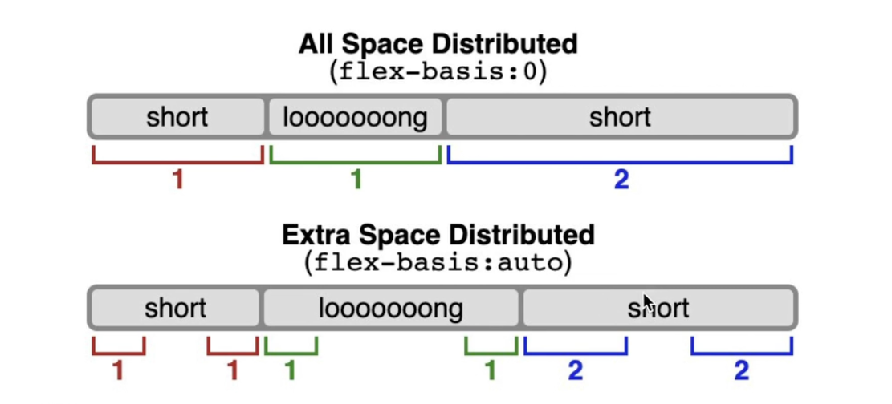

# Flexbox
- width and height in flex box are 'suggestions'. If a child's width is set to 200px, but the space is shrunk and it can only have 180px, it'll have 180px
  id:: 65b4c170-ee5c-4f8b-a79a-521296f67771
- `flex-basis`: is the same as 'same axis width or height ( depending on flex direction )' but not having to think if 'width' should be set or 'height' and 'which flex direction is right now', so it is kinda like flex-basis but without.
	- if there are height/width and flex-basis are applied then `flex-basis` wins
	- There is one more difference between `width` and `flex-basis`: `flex-basis` can't scale an element below its minimum content size, but `width` can.
- By default, `flex-grow` will distribute any *extra* space that isn't taken up by the elements.
- `flex-grow` > `flex-basis`. flex-grow says *chal iss person ko baaki ki space dede*
- `flex-shrink`: rate at which the set child shrinks. `flex-shrink` only does something when child is between it's hypothetical size and it's minimum size [minimum size is smallest an item can get without its contents overflowing] ( the content can't shrink anymore )
- When we use `flex-grow` and `flex-shrink`, we use unitless values like `1` or `10`. What do these numbers signify?
	- They represent *a ratio of the available space*.
	- ```html
	  <style>
	    .row {
	      display: flex;
	    }
	  
	    nav, aside {
	      flex-grow: 1;
	    }
	  
	    main {
	      flex-grow: 3;
	    }
	  </style>
	  
	  <div class="row">
	    <nav></nav>
	    <main></main>
	    <aside></aside>
	  </div>
	  ```
		- We want the `main` element to consume *3 times* as much space as `nav` or `aside`. It gets 3 "units" of space, whereas `nav` and `aside` only get 1 unit. To find out the actual percentage, add all the numbers together. In this example, there are 5 units total (1 + 3 + 1). That means that `nav` and `aside` each get 20% of the total space (1 / 5), whereas `main` gets 60% (3 / 5).
	- Similarly, `flex-shrink` is also based on the ratios between elements.An element with `flex-shrink: 3` will shrink 3x faster than an element with `flex-shrink: 1` (though `flex-shrink` also takes the element's size into consideration).
- `flex-1` === `flex-grow-1` + `width: 0` ([hypothetical size](logseq://graph/toyj?block-id=65b4c170-ee5c-4f8b-a79a-521296f67771)) === flex-grow: 1 + flex-shrink: 1 + flex-basis: 0
- 
	-
- flex algorithm allows ***minimum size of an element*** to be the lowest possible intrinsic size ( for text it would be the place where any particular word reaches its min width without wrapping alphabets in the middle). To want to override it: `min-width: 0` on flex children.
- When there is a conflict between layout modes, **positioned layout always wins.** Our help button will become fixed to the bottom-right corner of the viewport, and the `.row` Flex container will ignore it, and act as though it only has one child (`<main>`).
	- ```html
	  <style>
	    .row {
	      display: flex;
	    }
	  
	    .help-btn {
	      flex: 1;
	      position: fixed;
	      right: 0;
	      bottom: 0;
	    }
	  </style>
	  
	  <section class="row">
	    <main>
	      <!-- Stuff here -->
	    </main>
	    <div class="help-btn"></div>
	  </section>
	  ```
- As a general rule, elements can't participate in multiple layout modes at once. Either it's using flexbox, or it's using positioned layout. This is ultimately a very good thing, because CSS would be much more complicated if this wasn't true!
	- ```
	  What about relative positioning? (info)
	  
	  An exception to this rule is relative positioning, but it's kind of a special case.
	  
	  When you give something relative positioning, you're instructing it to move based on its normal position. That normal position is "inherited" from whichever layout mode it happens to be rendered by.
	  
	  If you give a flex child relative positioning, that element is technically being rendered in two different layout modes, but they're compatible; the element is first laid out inside the flex container, and then transposed using top/left/right/bottom by positioned layout.
	  
	  Similarly, sticky positioning can also work in a flex container, though there is a bit of a "gotcha" there. We'll see it in the next lesson!
	  ```
- Flexbox algorithm *also supports z-index*. If our element is being laid out with Flexbox, it uses `z-index` as if it was rendered with Positioned layout. The same thing is true for CSS Grid; a child in Grid layout can use `z-index` without setting `position: relative`.