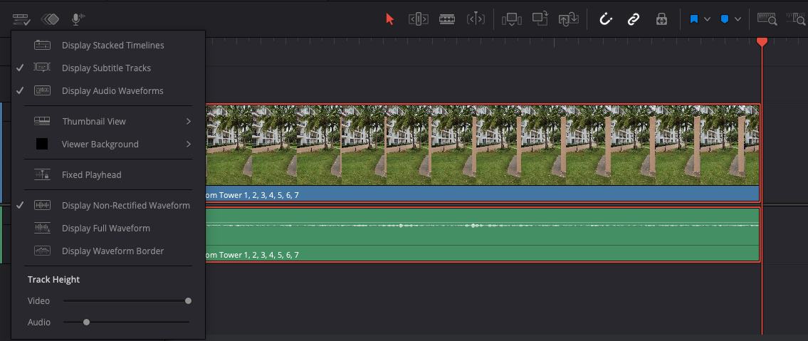

- #learning #DaVinciResolve
	- # Media Tab
		- ## Adding Resource Locations
		- Can import a folder by right clicking on the top left sidebar and adding **Add New Location**
		  logseq.order-list-type:: number
		- Right click any folder one wants to add clips to the **CUT** tab by right clicking the 'bin'(folder) and clicking: **Add Folders and Subfolders into Media Pool(create bins)**
		  logseq.order-list-type:: number
		- ## Keyboard Shortcut
		- `Shift+S` mutes the video while scrubbing(hovering) on top of the clips added to the bin
		  logseq.order-list-type:: number
		- ## Meta Data
		- Click any clip in media tab -> inspector(top right) -> file tab -> can add meta data.
		  logseq.order-list-type:: number
		- Also showed how to import a meta data csv, but since not a use case right now, not writing.
		  logseq.order-list-type:: number
		- In media tab, select all files of a bin -> (right click) -> clip attributes -> name tab -> write `%` and meta data attributes can be used to rename clips anything we want.
		  logseq.order-list-type:: number
		- ## Edit Tab
		- In the sidebar, click master, and then from tile -> New Bin, called 'TIMELINES'. Then file -> Add Timeline (command + N), name it. *So we can have multiple timelines for the same project* and it's good to have them sorted in a 'TIMELINES' bin.
		- Double click a clip, it shows in the <first thing> (video preview). Drag it to the right in the *Timeline View* and we have a bunch of functions we can use. Default is **overwrite**. The clip also comes into the timeline. Keyboard shortcut: ***up arrow*** to bring arrow to the start of the timeline
		- **Keyboard shortcut**: to scrub one keyframe at a time: either left or right arrows. Or keep pressing `K` and press `J` or `L`
		- Press `i` for setting in point and `o` for setting output. `Shift + i` and `Shift + o` to jump to them correspondingly. To preview the clip between in and out point: `Opt + /`
		- Wherever the scrubber is, if want to listen from there to the out point: In the menu -> playback -> Play around to -> Play to out ( `Opt+Command+/`)
		- `F10` = override clip -> bring clip between in and out points to the timeline
		- To bring in any other clip from the media, from the first upper window drag it to the timeline view window on the right, and this time drop on 'insert' function option.
		- While hovering on the left window (the scrubber one), we have an option to video/audio, dragging either of which to the timeline window, will only bring that, not the other one. So to drop the audio and only add video, we drag and drop from the video icon on the left to the timeline window on the right.
		- If the audio is disabled by clicking the button as in the screenshot, and then we add do `F10` the selected clip will be inserted without audio.
		  
		  
		- If we want to go forward into the clip in the scrubber view for a particular amount of time. Go to the top timeline display thing. Click it, hit `+` and then write that time.
		- `command +` and `command -` zoom in and zoom out. `Shift z` to fill the timeline window. Doing `Shift z` again will bring the zoom to previous zoom level, it toggles
		- In the timeline: `Shift + scroll` on either audio or video -> Changes preview / waveform size. If a mouse doesn't have a scroll wheel. Click this icon on the top of timeline (top left of timeline) and change from there 
		- If an audio and video are linked ( marked by a link icon on both the audio and video), and if you want to select only one of them, and not two of them together = `Opt + Click`
		- Unselect linking for the whole timeline ( click the big link button on the top of the timeline )
		- Ripple delete = `Shift + delete`
		- `b` = blade mode. `a` selection mode, `t` trim edit mode
		- For trim mode, if while scrubbing to 'vanish' the resource(video or audio) if snapping is not doing it for you, remove the snapping by either clicking on a horse shoe like icon (beside link in the timeline toolbar) or key `N`. **Keyboard shortcuts**: `.` remove frames, `,` add frames
		- Any clip in the timeline -> select them -> switch to trim mode -> right click on the selected clips ( any clip ) -> change clip duration = ***helpful to change clip durations in bulk***
		- Lock resource -> in trim mode, after locking say audio, and you start scrubbing the video, the audio will stay put and not come with video
		- **Shuffle insert**: Normal selection tool overrides, if we try to re order clips. Select any clip, then `Shift + Command/Cltr + (,/.)` to move forward, backward, to reorder that clip. Can select multiple resources together with this operation.
		- Selected resource(say video) -> `command + arrow(left/right)` selection changes to the corresponding resource.  Can select multiple resources together with this operation.
		- Slip edit: Trim mode, if any 'in between' clip(clip which has something to the right and the left), we press the trim buttoned cursor on the top portion of the clip(i.e. not click on the blue portion of the clip) we can see the trim(as we scrub) relative to start and end of neighbour clip, as well as the actual clip, had it not been scrubbed to trim.
		- **Change speed of clip**: select clip -> inspector -> video -> scroll down -> **Speed Change**
		- **Way to use different part of a same shot**: For a trim scrubbed clip -> select that clip and hit `f` to bring the source clip in the scrubber timeline -> set the playhead -> `F11` (replace edit) -> the selected scrubbed video will be replaced by the origin source clip from playhead to the end.
		- ---
		- Keep the red scrubber of timeline in the middle of a clip -> press `x` -> it marks the in and out as the start and end of the clip. Can both forward and back time. Forward: select an in point and out point will be the end of the clip automatically. Back select an out point and in point will be the start of the clip automatically
		- `Option + click` = add keyframes in the audio (still in the edit tab)
		- Normalise the audio: select audio clips => right click -> normalise audio levels. This will normalise peak levels
		- `Option + Command + -` => manually nudge down audio 1db at a time
		- *TRANSITIONS*: Choose between two clips edit point -> software top menu -> timeline -> add transition.
			- Can right click on transition ( in the timeline ) and change transition duration
			- Inspector -> Transition tab -> Can select a bunch of effects and their settinsg
			- Effects Library ( top tabs beside media pool) -> All transitions to chose from. If you run(hover) through the transition name, can preview it.
		- **Full Screen Preview**: Software menu -> workspace -> viewer mode -> Cinema Viewer
- #learning #DaVinciResolve
	- [Tut,Video: Freeze Frames in DaVinci Resolve](https://www.youtube.com/watch?v=qP-HUwvMaUI)
	- [Tut: Video: Aspect ratio in Da Vinci Resolve](video https://www.youtube.com/watch?v=lShO2qFEnf4): especially for extracting portrait mode from landscape mode video
	- [Tut, Video: Word by Word Animation with Opacity](video https://www.youtube.com/watch?v=t8JUcYF71Xc)
- **Keyboard shortcut**: `shift + arrow key`: jump one second in the timeline