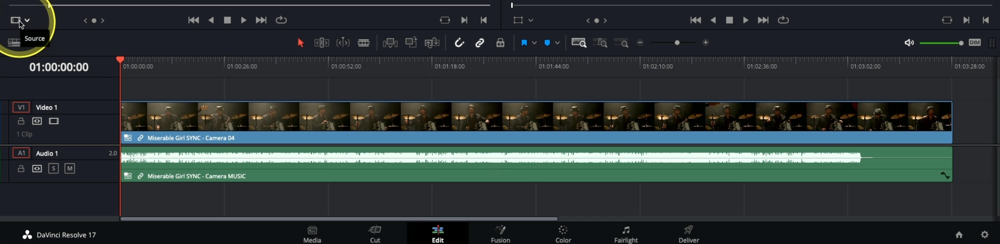

- #learning #DaVinciResolve
	- **Auto align clips(multicamera)**: two clips, two audios(if), select both linked clips -> right click -> *Auto Align Clips*. Two ways: Timecode matching, waveform matching.
	- Right click timeline -> Convert Timeline to Multicam Clip
	- **(Regular advice)**: can put in and out marks in timeline video itself also, instead of making blade edit mode cuts
	- **(multicam timeline)**: set scrubber at a place => right click on a clip -> *Switch Multicam Clip Angle* -> Select Video
	- **(bring back source clips)**: select all multicam clips -> right click -> *Flatten Multicam Clip*
	- ---
	- **multicam clips with more than 2 cameras**: select bin, right click bin (if we want all of the videos, otherwise, select clips we want and right click) -> *Create New Multicam Clip Using Selected Bin*
		- Angle Sync: the person selected 'Sound'
		- Angle Name: Metadata Camera (to choose order of the cameras and names of cameras)
		- Click create
		- Check the multicam clip sync by playing
	- Create new timeline
	- On the left side choose 'multicam'. It'll give options to only cut picture, audio or both
	  
	- And THEN! From the left side waala view, Can select which view to select with the audio, and keep selecting them and it'll keep reflecting int he timeline—as if doing a live match editing.
	- Can go through the whole timeline to switch or trim different camera angles again.
	- **(general advice)**: If two clips are same and a b-cut is made, select the edge and hit delete to remove it, if it needs to be removed
	- **replace camera angle:** Go to any clip where you need to replace the multi cam, go to the upper left side view thing, select the multicam(`opt + click`) and it will replace instead of insert.