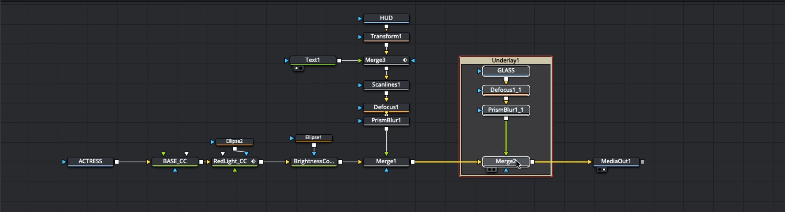

# Fusion
- Create your own render range: `cmd+(click and drag)`
- Viewer: `cmd+f` to fit the video in the reviewer(if one has already zoomed in and moved the video clip in the viewer around)
- To load a node in the media viewer: select node + click 1 -> to load node to media 1 viewer.
- `Shift+F4` switch to edit tab
- Rename a node shortcut: select node, fit `F2`
- Mode node out of pipeline: `Shift+Drag Node Out`
- 