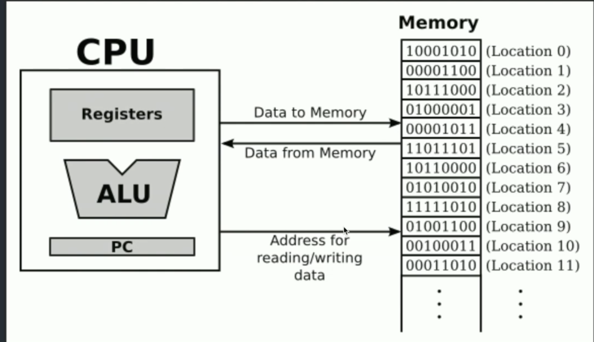

- [Link of Course](https://frontendmasters.com/courses/javascript-cpu-vm)
- ##  Physical & Virtual Machines
- CPU pin outs ( 600-1000 pin out legs)
- Silicon for CPU, silicon for memory <-> Interconnect
- Why separate silicon for CPU and separate for memory?
	- Manufacturing process for DRAM is incompatible for logic. They can't physically put them on same silicon -> separate manufacturing process
- VMs convert high level language into assembly and machine
- V8 is a VM for JavaScript. Others: JavascriptCore ( on which Bun is based ), Spider Monkey
- At the end of the day Physical Machine ( CPU ) is just numbers
	- Numbers
	- Arithmetic Operations
	- Flat Memory
	- Conditional Jumps
	- Subroutine
- Virtual Machine has to create an illusion for all of the below using above
	- Strings
	- Local Variables
	- Memory Management ( GC )
	- Conditionals
	- Looping
	- Primitive Types
	- Objects / Arrays
	- Classes
	- Functions / Closures
	- Exceptions / Stack Traces
- CPU
	- Registers
	- ALU ( Maths )
	- PC (  Program Counter ), a special register
		- pointer to a location of next instruction to read
	- 
	- From top: line 1, 2, 3
		- PC (line 3, a 64 bit wire) reads the address of next instruction. From that address the instruction goes from line 2 ( data from memory ) to CPU to tell it what to do. PC then auto increments and this process continues
- ## CPU Basics & Speed Limits
- Explained a very simple CPU instruction set using JavaScript remodelling ( of registers and instructions ) with switch statement and instruction enums
- Explained that CPU frequency can't go beyond 2-2.5GHz because of physical limitation of how fast electrons can move in the limited size of CPU chips that we have inside our devices
- Explained 'Speculative Execution': CPUs are able to do multiple instructions per CPU cycle because CPUs have statistics build in, with memory, so they would say 'okay last time I was at this branch, I did this, so I can do that again, let's do that'
	- Most cases on execution of one instruction, it tells the CPU that the guess it had made as a dependency for the other instruction, within the same CPU cycle, without waiting on the result of the execution of instruction 1 is correct.
	- If it's not, the work has to be thrown away. It doesn't commit it.
	- Sometimes we get bizarre bugs like the spectre attack: speculatively read execute memory that doesn't belong to you.
	- Side effect of speculation: even though the committing doesn't happen, you can see what intermittently got loaded in registers temporarily.
- So clock frequency has reached its limit, number of operations per cycle might also have hit a limit. The only thing that we can be doing to increase CPU performance is to add more cores.
	- Some are super fast, but eat lot of battery.
	- Some are slow and they sip on battery (default).
- Why does all of this matter for Javascript? Because it has a design flaw: it is single threaded. Which means we can only utilise one CPU core at a time.
- ## CPU Memory Management
-