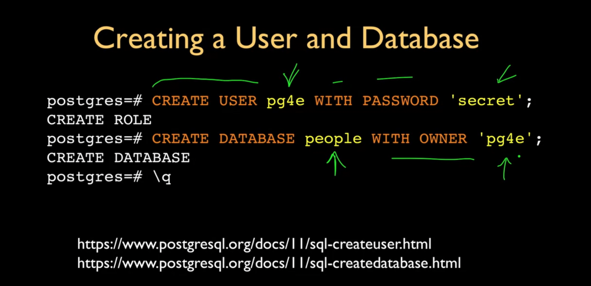

- [[Aug 7th, 2024]]
	- SQL is a standard non procedural language. A bunch of query code goes in -> database builds using a query builder [see ((66b3b6fb-8b91-44b6-a948-826ae27a0702))] and then figures out how to fetch the data quickly and returns the required data
	- > Timing is everything. You can’t standardize a technology too early, or else you drive innovative concepts away. If you standardize prematurely, companies think there’s no way to enter the market because everything is already decided. Even if the resulting standards and implementations aren’t very good, there’s no point in developing a better product because it will be “non-standard.” This kills innovation. On the other hand, if you start the process too late, you miss the opportunity and end up with too much variety in the marketplace; too many different approaches become well established and resist any kind of market-wide standardization.
	- ## SQL Architecture
		- Create a database user and a database
		  collapsed:: true
			- 
		- `\l` -> list databases
		- `dt\` -> show tables/relations
		- Create a table
		  
		  ```sql
		  CREATE TABLE users(
		    name VARCHAR(128)
		    email VARCHAR(128)
		  );
		  ```
		- `\d+ users` -> show me the schema of users table