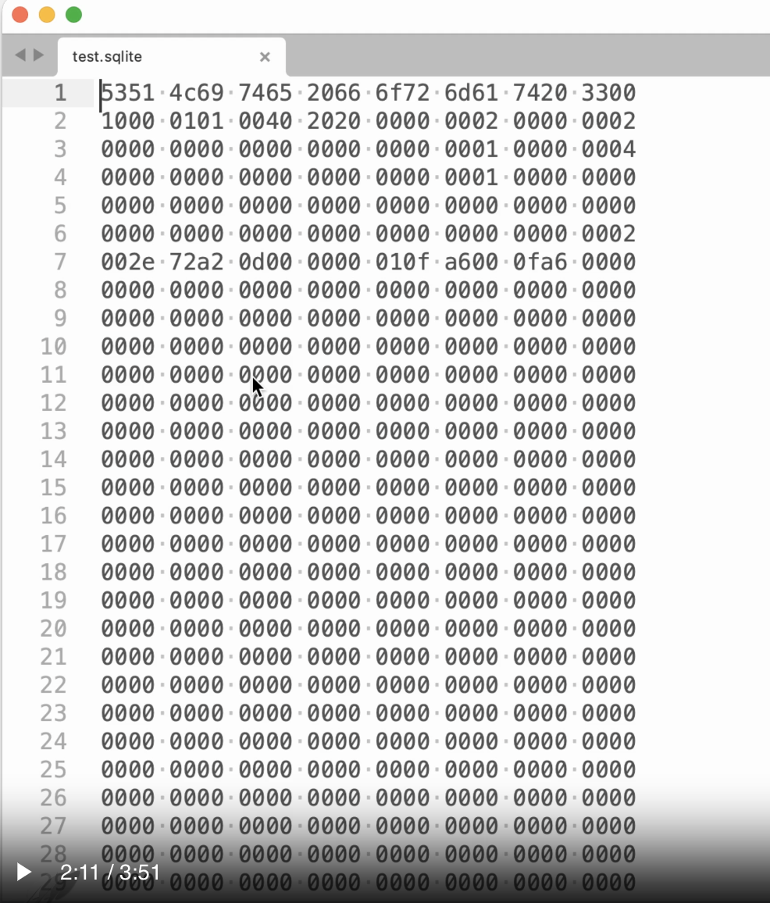

- [[Aug 7th, 2024]]
- ##  SQLite Internals
  id:: 66b3b6fb-8b91-44b6-a948-826ae27a0702
	- 
	-
	- ## SQLite's File Format
		- Pages: equally sized chunks of data
		- Special Pages:
			- lock
			- free pages location
			- settings
				- version
				- mode (rollback/wal)
				- chunksize -> (512 - 65536 bytes)
		- When page is deleted, it doesn't compress, the delete page stays where it is as empty.
		- The database looks like this:
			- 
		- the top row is a magic string, when formatted with ascii decoder it reads
			- `echo "<the first row numbers>" | xxd -r -p` -> SQLite format 3
- ## Dot Commands
	- `.shell clear`
	- `.help`
	- `.headers on`
	- `.mode`: there are 14 in total
		- `.mode json`
		- `.mode box`
		- `.mode box --wrap 50 -ww` ( word wrap 50 )
		- `.mode html`
		- `.mode csv`
			- `.separator "whatever separator here"`
		- `.mode qbox` === `box --wrap 60 --wordwrap off --quote` ( wordwrap off is not very nice )
		- `.mode insert`
			- Will show actual insert statements, which could be helpful to populate other table / other database, help transfer data.
		- keep mode as insert and then `.output some_file.sql`
			- any query will write insert statements in the `some_file.sql
		- `.once` -> write to for example `.output some_file.sql` only once. Write an SQL query. Any subsequent SQL query will not write to the file again.
		- `.tables`
		- `.schema`
		- `.expert`
			- Write any SQL query, say `select * from users where name = 'Arihant'` and it'll throw an index SQL query ( which is an index suggester ) like `CREATE INDEX users_idx_00015x29 ON users(name)` and `SEARCH users USING INDEX users_idx_00015c29 (name=?)`
		- `.exit`
		- `.load csv` ( load csv extension)
	- ## Pragmas
		- `pragma pragma_list;` : shows all pragmas available in a list
		- `pragma page_size`: 4096
		- `pragma page_count`
		- `pragma busy_timeout=5000;` ( can set ). Is also a getter without `=`
		- some of the pragma (and dot) commands are persistent, some are ephemeral/session level ( per connection )
		- `pragma journal_mode;` (persistent)
			- outputs `delete` (rollback mode), will talk about it later
		- `pragma foreign_keys=1;` ( session level setting )
			- in web frameworks will need to enable this every time connection is built
	- ## Virtual Tables
		- `.load csv`
		- `CREATE VIRTUAL TABLE temp.t1 using csv(filename="sample.csv", header=true);`
		- `select * from t1;` -> emits the table from the data in sample.csv -> using csv as if it's a table
		- `select * from generate_series(0, 100, 5);` -> start from 0, count every 5th and output it in a `value` column
	-